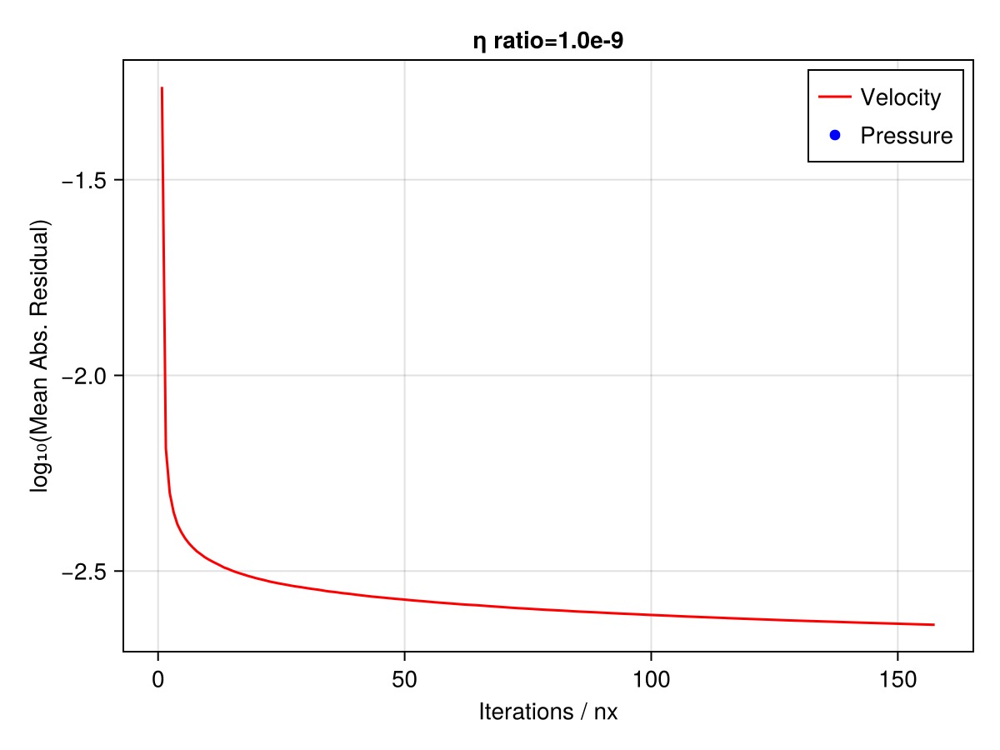
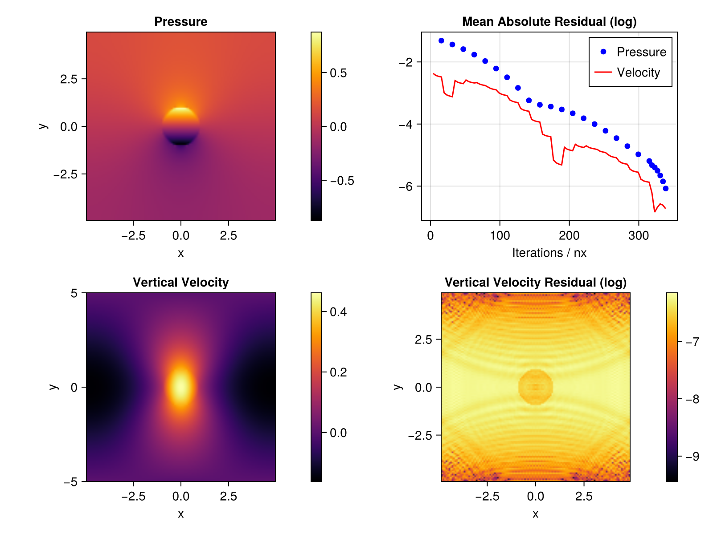

# Conjugent Gradient Solver for the Full Stokes Equation

This repository contains the work done in my master thesis project. The goal is to implement a conjugent gradient method that solves the full Stokes equation that arises in ice flow problems. The algorithm will be designed specifically for execution on GPUs using the Julia programming language.

## Documentation of Progress

### Step 0: Introduction to the Conjugate Gradient method

I follow the derivation of the Conjugate Gradient (CG) method given by Shewchuk's *An Introduction to the Conjugate Gradient Method Without the Agonizing Pain*. The pseudo-code is implemented and reproduces the figures of the publication.

The method of conjugate gradients solves the linear system $Ax = b$ iteratively in the following way, using some initiial guess $x_0$:

> $r_0 = b - Ax_0, \quad d_0 = r_0$
>
> **while** not converged **do**
>>
>> $\alpha = \frac{r_i^T r_i}{d_i^T A d_i}$
>>
>> $x_{i+1} = x-i + \alpha_i d_i$
>>
>> $r_{i+1} = b - A x_{i+1}$
>>
>> $\beta_{i+1} = \frac{r_{i+1}^T r_{i+1}}{r_i^T r_i}$
>>
>> $d_{i+1} = r_{i+1} + \beta_{i+1} d_i$

*Note:* Classical CG uses an update rule for $r_{i+1}$ instead of computing the rsidual

### Step 1: 2D Stokes equation with simple pseudo-transient solver

In this step, a non-accellerated pseudo-transient (PT) solver is used to solve the linear Stokes equation in two dimensions. The code follows the example miniapp in *ParallelStencil.jl* (PS). The main algorithmic change is that we compute the pseudo time step using the maximum viscosity of the neighbouring cells, instead of taking the average. This allows convergence even for large relative differences in viscosity.

We start from the stokes equation
$$
\nabla \cdot \tau - \nabla p + \rho g = 0 \\
\nabla \cdot V = 0 \\
\text{where} \tau = 2\eta \left( \frac{1}{2} \left( \nabla V + \nabla V^T \right) \right)
$$

And augment the equation with derivatives in dual time $\theta$:

$$
\tilde \rho \frac{\partial V}{\partial \theta} = -\nabla p + \nabla \cdot \tau + \rho g \\
\frac{1}{\tilde \kappa} \frac{\partial p}{\partial \theta} = \nabla V
$$

This system is evolved in dual time until the derivatives become zero, which means that the variables solve the original equations. 


The figure shows that the result is visually identical to the one reported in PS, but the convergence is slower. The pattern of the velocity residual is also not identical.

If the ratio between inner and outer viscosity are increased, the number of iterations required increase, as can be seen in the following figure:


For even larger ratios (1e-6 or 1e-9) the observed convergence is very slow and not monotone. 


### Step 2: Applying the augmented Lagrangian method

The main reference for this step is: *Numerical solution of saddle point problems* (Benzi et al., 2005)

We consider the same setting as in step 1. If the Stokes equations are discretised using FD, they can be formulated as linear system of equations:

```math
\begin{bmatrix}
A & -G \\
-G^T & O
\end{bmatrix}
\begin{bmatrix}
v \\
p
\end{bmatrix}
= 
\begin{bmatrix}
f \\ 
0
\end{bmatrix}
```

Where $v$ and $p$ are flattened velocity and pressure vectors. $G / G^T$ are discretised gradient and divergence, $A v$ represents $2\eta \left( \frac{1}{2} \left( \nabla V + \nabla V^T \right) \right)$, and $f = - \rho g$.

This system can be solved via an augmented Lagrangian functional:

$$
\mathcal{L}(v, p) = \frac{1}{2} v^T A v - f^T v - v^T G p + \frac{\gamma}{2} \left|\left| G^T v \right|\right|_2^2
$$

This Lagrangian can be minimised iteratively, using some initial guess for $p$:

> **while** not converged, **do**
>
>> solve $(A + \gamma G G^T) v = f + G p$
>>
>> set $p = p - \gamma G^T v$

For convenience, we introduce an additional pressure field. While the first is set in every inner iteration according $p = \hat p - \gamma G^T v$, the second stores the ``old'' pressure value and is only updated in outer iterations ($\hat p = p$). This allows for a formulation of the inner iteration that is closer to physics.

This approach can also be derived via block elimination from the *regularised* linear system:

```math
\begin{bmatrix}
A & -G \\
-G^T & - \frac{1}{\gamma} I
\end{bmatrix}
\begin{bmatrix}
v \\
p
\end{bmatrix}
= 
\begin{bmatrix}
f \\ 
\frac{1}{\gamma} \hat p
\end{bmatrix}
```
The inner iteration is solved for $v$ using a conjugate gradient method. For this, we precondition the system matrix $A + \gamma G G^T$ with a diagonal matrix $M$ where $M_{ii} = \frac{\min\{\Delta x, \Delta y \}^2}{4.1 \cdot (\mathrm{maxloc_{i}}\{\eta\} + \gamma)}$. The parameter $\gamma$ is set to $\max\{\eta\}^{-1}$

In the current form (30.10.24), the conjugate gradient shows good convergence at first, however it dies out rather quickly and fails to reduce the residual to the desired tolerance.



Using early termination, i.e. limiting the number of CG-iterations per step, we can obtain reasonable results even for high viscosity ratios. The following figures shows the output for a viscosity of $0.1$ and $10^{-9}$ in the inclusion:





We can see that the convergence behaviour is essentially the same in both cases. The oscillatory behaviour of the residuals is introduced by the early termination and resembles the results seen in the pseudo-transient approach (according to Ivan).

Investigating the system matrix that is implicitly used in the code revealed that in the current state, the matrix is not symmetric. Therefore it violates the assumptions of CG. This explains why the convergence in the inner iteration is unsatisfactory.