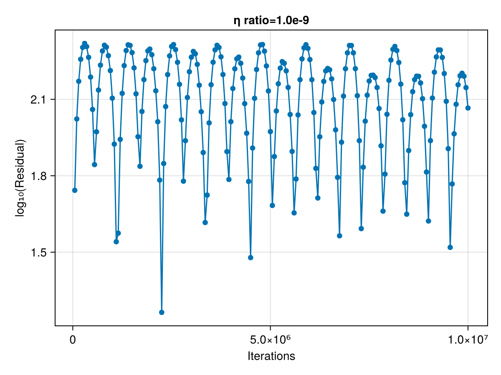

# Conjugent Gradient Solver for the Full Stokes Equation

This repository contains the work done in my master thesis project. The goal is to implement a conjugent gradient method that solves the full Stokes equation that arises in ice flow problems. The algorithm will be designed specifically for execution on GPUs using the Julia programming language.

## Documentation of Progress

### Step 0: Introduction to the Conjugate Gradient method

I follow the derivation of the Conjugate Gradient (CG) method given by Shewchuk's *An Introduction to the Conjugate Gradient Method Without the Agonizing Pain*. The pseudo-code is implemented and reproduces the figures of the publication.

The method of conjugate gradients solves the linear system $Ax = b$ iteratively in the following way, using some initiial guess $x_0$:

> $r_0 = b - Ax_0, \quad d_0 = r_0$
>
> **while** not converged **do**
>>
>> $\alpha = \frac{r_i^T r_i}{d_i^T A d_i}$
>>
>> $x_{i+1} = x-i + \alpha_i d_i$
>>
>> $r_{i+1} = b - A x_{i+1}$
>>
>> $\beta_{i+1} = \frac{r_{i+1}^T r_{i+1}}{r_i^T r_i}$
>>
>> $d_{i+1} = r_{i+1} + \beta_{i+1} d_i$

*Note:* Classical CG uses an update rule for $r_{i+1}$ instead of computing the rsidual

### Step 1: 2D Stokes equation with simple pseudo-transient solver

In this step, a non-accellerated pseudo-transient (PT) solver is used to solve the linear Stokes equation in two dimensions. The code follows the example miniapp in *ParallelStencil.jl* (PS). The main algorithmic change is that we compute the pseudo time step using the maximum viscosity of the neighbouring cells, instead of taking the average. This allows convergence even for large relative differences in viscosity.

We start from the stokes equation
$$
\nabla \cdot \tau - \nabla p + \rho g = 0 \\
\nabla \cdot V = 0 \\
\text{where} \tau = 2\eta \left( \frac{1}{2} \left( \nabla V + \nabla V^T \right) \right)
$$

Which we solve on the domain $\Omega = [-L, L]^2$, equipped with boundary conditions
$$
V_x(x=\pm L) = 0 \\
V_y(y=\pm L) = 0 \\
\left.\frac{\partial V_x}{\partial y} \right|_{y=\pm L}  = 0 \\
\left.\frac{\partial V_y}{\partial x} \right|_{x=\pm L} = 0 \\
$$ 

And augment the equation with derivatives in dual time $\theta$:

$$
\tilde \rho \frac{\partial V}{\partial \theta} = -\nabla p + \nabla \cdot \tau + \rho g \\
\frac{1}{\tilde \kappa} \frac{\partial p}{\partial \theta} = \nabla V
$$

This system is evolved in dual time until the derivatives become zero, which means that the variables solve the original equations. 


The figure shows that the result is visually identical to the one reported in PS, but the convergence is slower. The pattern of the velocity residual is also not identical.

If the ratio between inner and outer viscosity are increased, the number of iterations required increase, as can be seen in the following figure:


For even larger ratios (1e-6 or 1e-9) the observed convergence is very slow and not monotone. 





### Step 2: Applying the augmented Lagrangian method

The main reference for this step is: *Numerical solution of saddle point problems* (Benzi et al., 2005)

We consider the same setting as in step 1. If the Stokes equations are discretised using FD, they can be formulated as linear system of equations:

```math
\begin{bmatrix}
T & -G \\
-G^T & O
\end{bmatrix}
\begin{bmatrix}
v \\
p
\end{bmatrix}
= 
\begin{bmatrix}
f \\ 
0
\end{bmatrix}
```

Where $v$ and $p$ are flattened velocity and pressure vectors. $G / G^T$ are discretised gradient and divergence, $T v$ represents $2\eta \left( \frac{1}{2} \left( \nabla V + \nabla V^T \right) \right)$, and $f = - \rho g$.

This system can be solved via an augmented Lagrangian functional:

$$
\mathcal{L}(v, p) = \frac{1}{2} v^T T v - f^T v - v^T G p + \frac{\gamma}{2} \left|\left| G^T v \right|\right|_2^2
$$

This Lagrangian can be minimised iteratively, using some initial guess for $p$:

> **while** not converged **do**
>
>> solve $(T + \gamma G G^T) v = f + G p$
>>
>> set $p = p - \gamma G^T v$

For convenience, we introduce an additional pressure field. While the first is set in every inner iteration according $p = \hat p - \gamma G^T v$, the second stores the "old" pressure value and is only updated in outer iterations ($\hat p = p$). This allows for a formulation of the inner iteration that is closer to physics.

This approach can also be derived via block elimination from the *regularised* linear system:

```math
\begin{bmatrix}
T & -G \\
-G^T & - \frac{1}{\gamma} I
\end{bmatrix}
\begin{bmatrix}
v \\
p
\end{bmatrix}
= 
\begin{bmatrix}
f \\ 
\frac{1}{\gamma} \hat p
\end{bmatrix}
```
We write the inner iteration as $Av = b$ and solve it  for $v$ using a conjugate gradient method. For this, we precondition the problem with a a diagonal matrix $M = \mathrm{diag}(A)$. The parameter $\gamma$ is set to $\max\{\eta\}$ by default. An alternative approach would be to set $\gamma = \overline \eta$

The matrix $A$ is symmetric only if boundary conditions are carefully handled. For Dirichlet conditions, the corresponding boundary cells are set to zero and treated as ghost cells. Therefore they do not contribute to $A$. Neumann conditions are enforced by fixing the corresponding stresses.

In the form written above, $A$ appears to be negative definite, since the jacobian of $b - Av$ is s.p.d. To successfully apply the CG method, the whole equation has to be negated.

In the following figure we show the result on the center values obtained from the miniapp setting. When using the vertex values, they look identical. For the residuals of the  velocity and pressure equations, the infinity norm is used. Convergence of the CG method is monitored via $\frac{||\alpha d_i||_\infty}{||r_0||_\infty}$.


The simulation was run using $127^2$ grid cells (as in step 1) with early stopping of the conjugate gradient iteration, a tolerance of $10^{-6}$, and a $\gamma$-factor of $10$.

If we change to a strong inclusion ($\eta_{in} > \eta_{out}$) the algorithm requires more time to converge. For a similar setting as above, but with $\frac{\eta_{in}}{\eta_{out}} = 10^3$, we find the best iteration count of just a bit more than $100\,\mathrm{n_x}$ for $\gamma = 0.5$.


For a very strong inclusion of $\frac{\eta_{in}}{\eta_{out}} = 10^6$, we cannot observe any convergence in the CG iteration. However, if run for 10000 steps, the residuals of pressure and velocity are reduced quickly, and only three Powell-Hestenes iterations are needed to match our absolute bound on residuals. If they are sensible in this case is again questionable, since the resulting pressure anomaly is very small, i.e. on the order of the error tolerance. 


**Note**: some parameters have to be chosen: the parameter $\gamma$ is probably the most obvious, it controls the "step size" of the method. Large $\gamma$ is expected to lead to fewer, but more expensive outer iterations. But we also need to set minimal requirement for early stopping. If we evaluate the CG convergence condition often (less than every 100 iterations), early stopping at $10^{-3}$ is not sufficient for overall convergence in the weak inclusion, however it seems to work for strong inclusion. In reality, how often we evaluate the convergence condition for CG is itself a parameter that can influence the result, since we may do additonal iterations that are not required by the error bound, but may improve the intermediate result we get at the end of the inner iteration.


### Step 3: Transfering to Arakawa E-Grid
In preparation for the nonlinear case, the code is ported to work on an Arakawa E-grid. This type of staggered grid keeps values for scalar fields at both the centers and the corners of computational cells. Fluxes are stored at all interfaces. In our case, the scalar fields are viscosity and pressure, while the velocity components represent fluxes. Compared to the staggered grid used in steps 1 and 2, the E-grid requires double the amount of memory. In the code, I keep two different arrays for data associated to cell "centers" and "vertices".

In the linear case, we are essentially solving the same problem on two grids simultaneously, since center and vertex values are coupled only via viscosity. 

If we change to a strong inclusion ($\eta_{in} > \eta_{out}$) the algorithm requires more time to converge. For a similar setting as above, but with $\frac{\eta_{in}}{\eta_{out}} = 10^3$, we find the best iteration count of just a bit less than $100\,\mathrm{n_x}$ for $\gamma = 1.$.