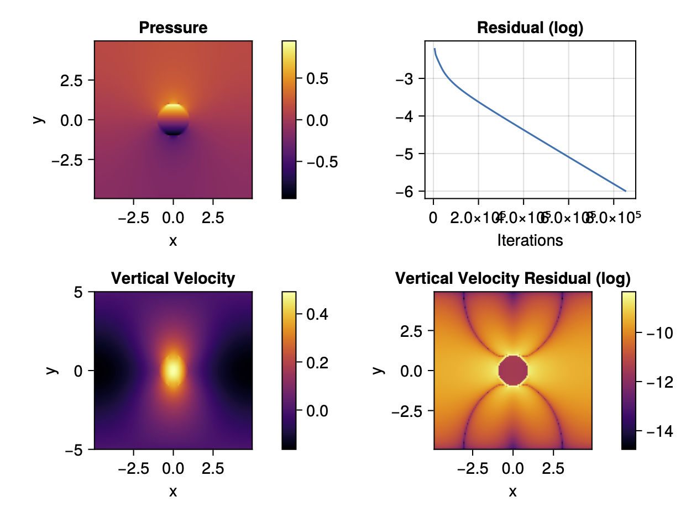

# Conjugent Gradient Solver for the Full Stokes Equation

This repository contains the work done in my master thesis project. The goal is to implement a conjugent gradient method that solves the full Stokes equation that arises in ice flow problems. The algorithm will be designed specifically for execution on GPUs using the Julia programming language.

## Documentation of Progress

### Step 0: Introduction to the Conjugate Gradient method

I follow the derivation of the Conjugate Gradient (CG) method given by Shewchuk's *An Introduction to the Conjugate Gradient Method Without the Agonizing Pain*. The pseudo-code is implemented and reproduces the figures of the publication.

### Step 1: 2D Stokes equation with simple pseudo-transient solver

In this step, a non-accellerated pseudo-transient (PT) solver is used to solve the linear Stokes equation in two dimensions. The code follows the example miniapp in *ParallelStencil.jl* (PS). The main algorithmic change is that we compute the pseudo time step using the maximum viscosity of the neighbouring cells, instead of taking the average. This allows convergence even for large relative differences in viscosity.

The figure shows that the result is visually identical to the one reported in PS, but the convergence is slower. The pattern of the velocity residual is also not identical.

If the ratio between inner and outer viscosity are increased, the number of iterations required increase, as can be seen in the following figure:

For even larger ratios (1e-6 or 1e-9) the observed convergence is very slow and not monotone. 

