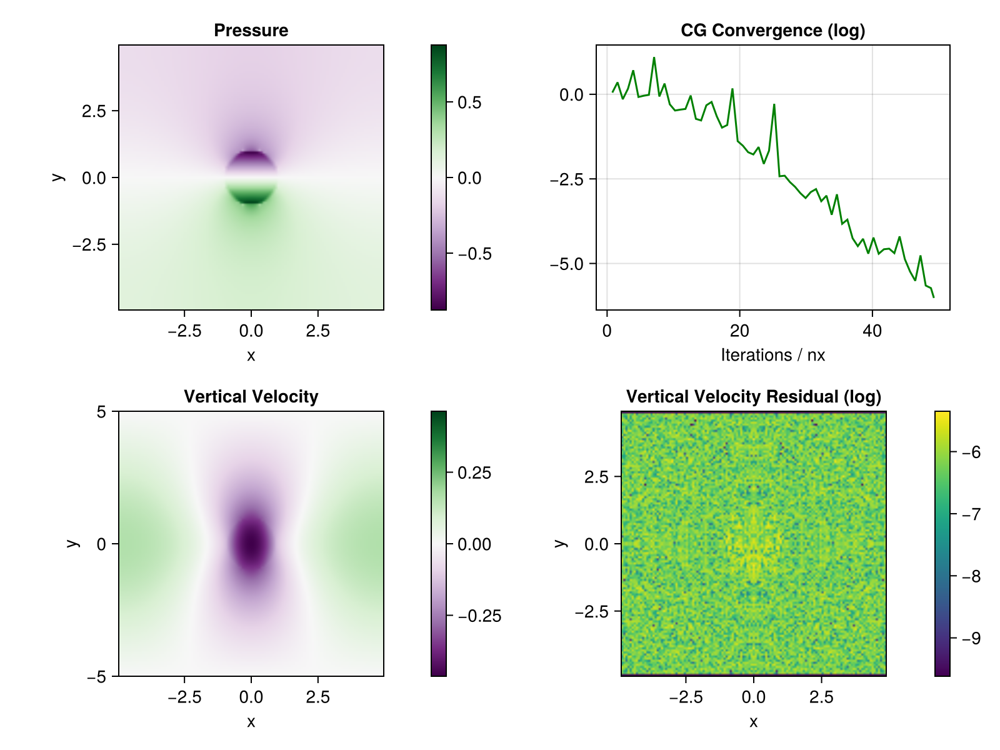

# Intermediate Meeting December 2024

## Augmented Lagrangian Method

### State of the Implementation

Still everything on the inclusion example

worked on non-dimensionalisation & convergence criteria

most recent configuration:
* use relative change in pressure for termination of outer loop: $\frac{||P - P_{old}||_{\infty}}{||P||_{\infty}}$
* for CG, use scaled residual: $\frac{||R||_{\infty}}{||\rho g||_{\infty} }$
* run CG until inner error metric is less than outer ("early termination")
* use relative tolerance $\epsilon \approx 10^{-6}$

* prescribe average $\eta$, $\rho g$, and domain extension
* choose $\gamma = c \cdot \max{\eta}$, with $c = 0.02, \dots,  10$ for decreasing viscosity constrast ($10^6, \dots, 10^{-3}$)

* report relative residuals for both pressure and velocity


tried other error metrics:
* relative residual also in outer loop $\frac{||\nabla \cdot V||_{\infty}}{||P||_{\infty}}$: can stall at some point
* relative change in CG: $\frac{||\alpha D_i||_{\infty}}{||R||_{\infty}}$: couln't work out how to detect convergence reliably
* scaled "preconditioned" residual in CG: $\frac{\sqrt{r^T M^{-1} r}}{||\rho g||_{2}}$: does not show convergence for high viscosities


*What I also thought I could try:*
* use relative change for CG the same way as in outer loop , i.e. monitor $\frac{||\alpha D||_{\infty}}{||V||_{\infty}}$
* adapt the value of $\gamma$ during the iteration

### Output of model runs

**result for miniapp setting**

uses $\gamma = 10$, initial tolerance for CG $\epsilon_{min} = 10^{-3}$

* Fast convergence
* benefit of early termination

**strong inclusion**

with $\frac{\eta_{in}}{}\eta_{out} = 10^6$

* requires many iterations to converge
* early termination "necessary" for first CG solve
* plots look the same for different reference values for $\rho g$ and $\eta$, except for relative pressure residual

## Coupled Conjugate Gradient Method

Solve the discretised problem

```math
\begin{bmatrix}
T & -G \\
-G^T & O
\end{bmatrix}
\begin{bmatrix}
v \\
p
\end{bmatrix}
= 
\begin{bmatrix}
f \\ 
0
\end{bmatrix}
```

directly with CG. As the matrix is not s.p.d., I think there are no convergence guarantees, but it can still work.



**current state**
* only a sub-optimal preconditioner implemented
* non-dimensionalisation is not handled correctly (e.g. convergence assessed using absolute tolerance $\sqrt{r^T M^{-1} r} < \epsilon$)
* converges for strong inclusions up to $10^3$ (requiring ca. $200 n_x$ iterations) 

## Next Steps

* Try replacing relative update in pressure loop with properly scaled residual (i.e. using time scale)
* Perform parametric study for optimal $\gamma$ depending on $\eta$-ratio, using randomly distributed circular inclusions
* Implement augmented Lagrangian for nonlinear (power law) viscosity
  * check derivation via Energy formulation (Schoof, 2006)
  * Newton Iteration only for velocity, i.e. can be performed in the outer loop
  * should be able to use same preconditioner 