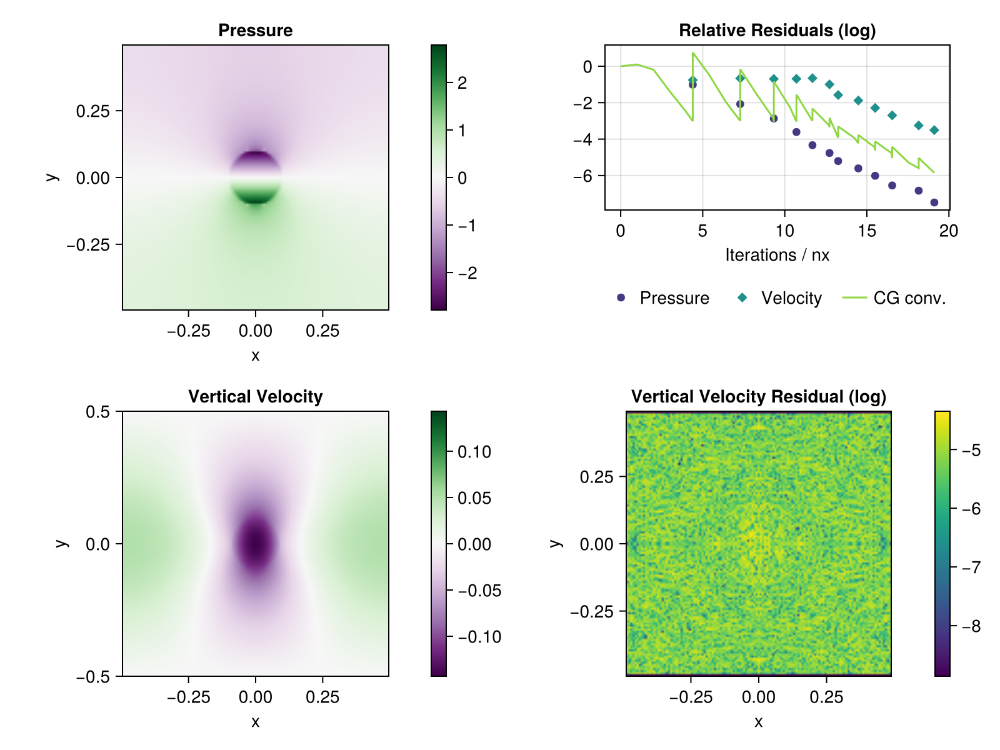
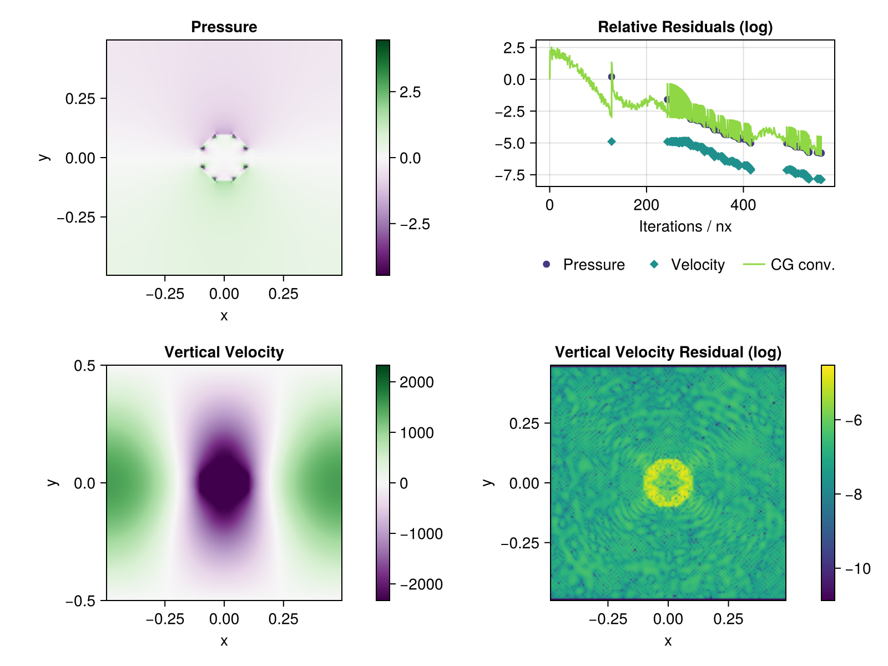
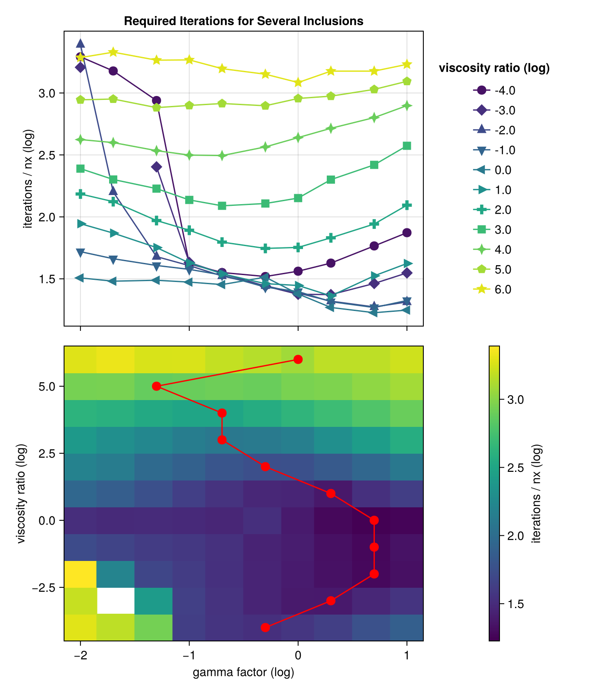
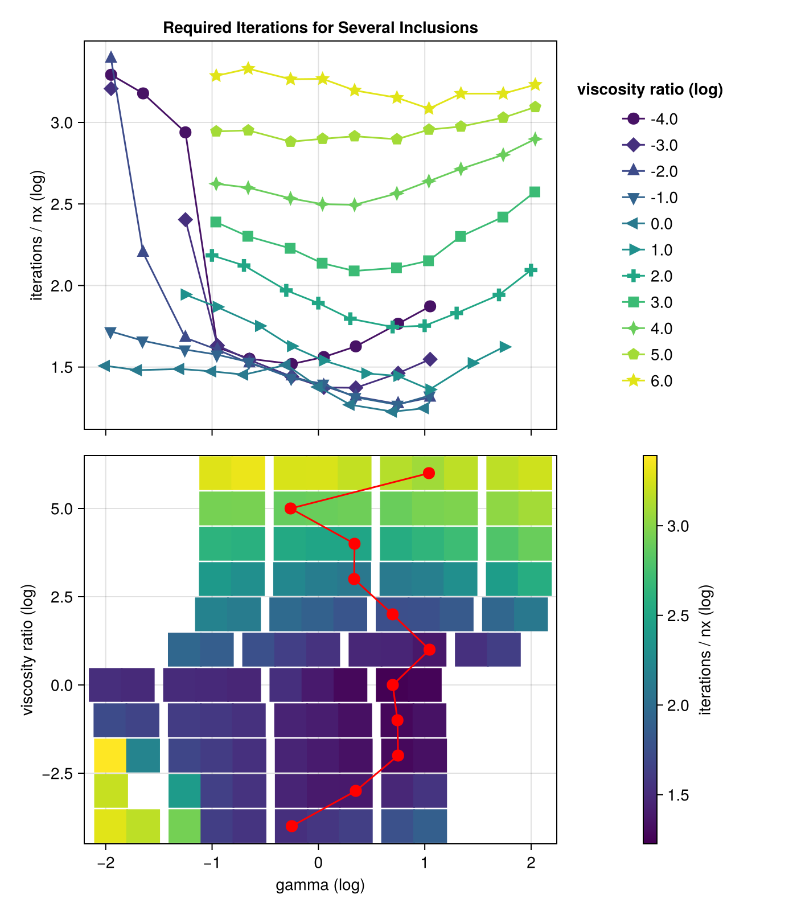

# Documentation of Progress

## Step 0: Introduction to the Conjugate Gradient method

I follow the derivation of the Conjugate Gradient (CG) method given by Shewchuk's *An Introduction to the Conjugate Gradient Method Without the Agonizing Pain*. The pseudo-code is implemented and reproduces the figures of the publication.

The method of conjugate gradients solves the linear system $Ax = b$ iteratively in the following way, using some initiial guess $x_0$:

> $r_0 = b - Ax_0, \quad d_0 = r_0$
>
> **while** not converged **do**
>>
>> $\alpha = \frac{r_i^T r_i}{d_i^T A d_i}$
>>
>> $x_{i+1} = x-i + \alpha_i d_i$
>>
>> $r_{i+1} = b - A x_{i+1}$
>>
>> $\beta_{i+1} = \frac{r_{i+1}^T r_{i+1}}{r_i^T r_i}$
>>
>> $d_{i+1} = r_{i+1} + \beta_{i+1} d_i$

*Note:* Classical CG uses an update rule for $r_{i+1}$ instead of computing the rsidual

## Step 1: 2D Stokes equation with simple pseudo-transient solver

In this step, a non-accellerated pseudo-transient (PT) solver is used to solve the linear Stokes equation in two dimensions. The code follows the example miniapp in *ParallelStencil.jl* (PS). The main algorithmic change is that we compute the pseudo time step using the maximum viscosity of the neighbouring cells, instead of taking the average. This allows convergence even for large relative differences in viscosity.

We start from the stokes equation
```math
\nabla \cdot \tau - \nabla p + \rho g = 0, \quad
\nabla \cdot V = 0
```
```math
\text{where} \quad \tau = 2\eta \left( \frac{1}{2} \left( \nabla V + \nabla V^T \right) \right)
```

Which we solve on the domain $\Omega = [-L, L]^2$, equipped with boundary conditions

```math
V_x(x=\pm L) = 0,  \quad
V_y(y=\pm L) = 0
```
```math
\left.\frac{\partial V_x}{\partial y} \right|_{y=\pm L}  = 0, \quad
\left.\frac{\partial V_y}{\partial x} \right|_{x=\pm L} = 0
```

And augment the equation with derivatives in dual time $\theta$:

$$
\tilde \rho \frac{\partial V}{\partial \theta} = -\nabla p + \nabla \cdot \tau + \rho g
$$
$$
\frac{1}{\tilde \kappa} \frac{\partial p}{\partial \theta} = \nabla V
$$

This system is evolved in dual time until the derivatives become zero, which means that the variables solve the original equations. 


The figure shows that the result is visually identical to the one reported in PS, but the convergence is slower. The pattern of the velocity residual is also not identical.

If the ratio between inner and outer viscosity are increased, the number of iterations required increase, as can be seen in the following figure:


For even larger ratios (1e-6 or 1e-9) the observed convergence is very slow and not monotone. 


## Step 2: Applying the augmented Lagrangian method

The main reference for this step is: *Numerical solution of saddle point problems* (Benzi et al., 2005)

We consider the same setting as in step 1. If the Stokes equations are discretised using FD, they can be formulated as linear system of equations:

```math
\begin{bmatrix}
T & -G \\
-G^T & O
\end{bmatrix}
\begin{bmatrix}
v \\
p
\end{bmatrix}
= 
\begin{bmatrix}
f \\ 
0
\end{bmatrix}
```

Where $v$ and $p$ are flattened velocity and pressure vectors. $G / G^T$ are discretised gradient and divergence, $T v$ represents $2\eta \left( \frac{1}{2} \left( \nabla V + \nabla V^T \right) \right)$, and $f = - \rho g$.

This system can be solved via an augmented Lagrangian functional:

```math
\mathcal{L}(v, p) = \frac{1}{2} v^T T v - f^T v - v^T G p + \frac{\gamma}{2} \left|\left| G^T v \right|\right|_2^2
```

This Lagrangian can be minimised iteratively, using some initial guess for $p$:

> **while** not converged **do**
>
>> solve $(T + \gamma G G^T) v = f + G p$
>>
>> set $p = p - \gamma G^T v$

For convenience, we introduce an additional pressure field. While the first is set in every inner iteration according $p = \hat p - \gamma G^T v$, the second stores the "old" pressure value and is only updated in outer iterations ($\hat p = p$). This allows for a formulation of the inner iteration that is closer to physics.

This approach can also be derived via block elimination from the *regularised* linear system:

```math
\begin{bmatrix}
T & -G \\
-G^T & - \frac{1}{\gamma} I
\end{bmatrix}
\begin{bmatrix}
v \\
p
\end{bmatrix}
= 
\begin{bmatrix}
f \\ 
\frac{1}{\gamma} \hat p
\end{bmatrix}
```
We write the inner iteration as $Av = b$ and solve it  for $v$ using a conjugate gradient method. For this, we precondition the problem with a a diagonal matrix $M = \mathrm{diag}(A)$. The parameter $\gamma$ is set to $\max\{\eta\}$ by default. An alternative approach would be to set $\gamma = \overline \eta$.

The equation is nondimensionalised to ensure that $\max{\eta} = 1$ and $\rho g_{in}$ is equal in magnitude than the normalised viscosity of the matrix.

The matrix $A$ is symmetric only if boundary conditions are carefully handled. For Dirichlet conditions, the corresponding boundary cells are set to zero and treated as ghost cells. Therefore they do not contribute to $A$. Neumann conditions are enforced by fixing the corresponding stresses.

In the form written above, $A$ appears to be negative definite, since the jacobian of $b - Av$ is s.p.d. To successfully apply the CG method, the whole equation has to be negated.

In the following figure we show the result on the center values obtained from the miniapp setting. When using the vertex values, they look identical. For the relative residuals of the  velocity and pressure equations, the infinity norm is used. Convergence of the CG method is monitored via $\frac{||R||}{||\rho g||}$.



The simulation was run using $127^2$ grid cells (as in step 1) with early stopping of the conjugate gradient iteration, a tolerance of $10^{-6}$, and a $\gamma$-factor of $10$.

If we change to a strong inclusion ($\eta_{in} > \eta_{out}$) the algorithm requires more time to converge. For a similar setting as above, but with $\frac{\eta_{in}}{\eta_{out}} = 10^6$, we find the best iteration count of just a bit more than $500\,\mathrm{n_x}$ for $\gamma = 0.02$.




**Note**: some parameters have to be chosen: the parameter $\gamma$ is probably the most obvious, it controls the "step size" of the method. Large $\gamma$ is expected to lead to fewer, but more expensive outer iterations. But we also need to set minimal requirement for early stopping. We observed good results with $\epsilon_{min} = 10^{-3}$ for moderate viscosity contrasts. For high viscosity ratios, it may be benefitial to relax this even more to values like $0.1$.


### Transferring to Arakawa E-Grid
In preparation for the nonlinear case, the code is ported to work on an Arakawa E-grid. This type of staggered grid keeps values for scalar fields at both the centers and the corners of computational cells. Fluxes are stored at all interfaces. In our case, the scalar fields are viscosity and pressure, while the velocity components represent fluxes. Compared to the staggered grid used in steps 1 and 2, the E-grid requires double the amount of memory. In the code, I keep two different arrays for data associated to cell "centers" and "vertices".

In the linear case, we are essentially solving the same problem on two grids simultaneously, since center and vertex values are coupled only via viscosity.

### Importance of the Parameter $\gamma$

We investigate the total number of conjugate gradient iterations required for convergence depending on the choice of $\gamma$. For this experiment, we use a enclosed square domain with free slip boundaries. In this domain are eight randomly distributed inclusions with different viscosities. The maximal viscosity ratio and average viscosity are prescribed. One inclusion is set to maximal contrast, while the others are randomly assigned a viscosity ratio (relative to the matrix viscosity). This value is at least half the maximal ratio (or double in the case of a ratio less than one). By fixing a seed for the pseudo-random number generator we can ensure that for fixed grid resolution, the distribution of inclusions is the same for all experiments.

We compare both the prefactor and the absolute value of $\gamma$ to the number of iterations. As can be seen in the following figures, the results look similar.




For weak inclusions, setting $\gamma$ small causes a much higher overall number of iterations, with up to three orders of magnitude difference. For strong inclusions, the algorithm is less sensitive to the choise of $\gamma$.

Unfortunately, we dont see a clear pattern how the optimal value for $\gamma$ could be predicted based on the viscosity ratio.


## Step 3: Applying CG to the full system

Instead of separating the pressure and velocity update as in the augmented lagrangian approach, we can try to solve the discretized system directly using a conjugate gradient method.

From the equation we know that the system will not be s.p.d., as it does not have full rank. Constructing the system matrix for boundary conditions as for the inclusion setting (closed box with free slip), but for randomly chosen viscosity, shows that it is symmetric, but indefinite. The matrix $-T$ discretizing $- \nabla \cdot \tau$ is s.p.d. The gradient discretization $G$ is rank defficient, which is expected since pressure is only defined up to a constant.

## Setp 4: Nonlinear Rheology

In ice flow, it is found that the viscosity depends (among others) strongly on velocity, whereas the influence of pressure is often neglected.
If we let $\dot \epsilon_E$ denote the first invariant of the strain rate tensor $\dot \epsilon$, the deviatoric stress can be computed by the relation
$\tau = B \dot \epsilon_E^{q - 2} \dot \epsilon$, where

```math
\dot \epsilon = \frac{1}{2} (\nabla v + \nabla v ^T)
````
```math
\dot \epsilon _E^2 = \frac{1}{2} \sum_{i, j} \dot \epsilon _{i,j}^2
```

The prefactor $B$ is fixed, but may vary in space due to temperature or grain properties.

Both $B$ and $q$ can be obtained from the standard formulation of *Glen's law*.

By using the general relation $\tau = 2 \eta \dot \epsilon$ we can define an "effective viscosity" $\eta = \frac{1}{2} B \dot \epsilon_E ^{q - 2}$

This allows to reuse the structure of the code as in step 2. However, the equation for velocity is now nonlinear, since the effective viscosity is nonlinearly dependent on the velocity field.
In consequent, the single conjugate gradient iteration has to be replaced by a Newton iteration involving the derivative of the residual.
We use again automatic differentiation with Enzyme.jl to get the gradients, and our own CG implementation to solve the linear system in each Newton step.

### A mathematical perspective

Starting from the strong form of the Stokes equations

```math
\nabla \cdot \tau - \nabla p +f = 0,
\quad \nabla \cdot v = 0
```

```math
\text{where} \quad \tau = B \dot \epsilon_E^{q - 2} \dot \epsilon,
\quad \dot \epsilon = \frac{1}{2} \left( \nabla v + \nabla v^T \right)
```

On the closed domain $\Omega$, equipped with free slip boundary conditions

```math
v \cdot n = 0 \quad \text{on } \partial\Omega, \quad 
\tau \cdot n = 0 \quad \text{on } \partial\Omega
```

Multiplication of the momentum equation with an adequate test function $w \in V$ and integration over $\Omega$ gives the weak form
$$
\forall w \in V \int_\Omega (\nabla \cdot \tau) \cdot w - \nabla p \cdot w + f \cdot w \,\mathrm{d}x = 0
$$

Applying Integration by parts, using homogeneous boundary conditions
$$
\forall w \in V \int_\Omega \nabla \cdot (\tau w) - p \nabla \cdot w + f \cdot w \,\mathrm{d}x = 0
$$

where we can replace $\nabla \cdot (\tau w) = \tau : \dot \epsilon (w)$

This integral is the Gâteaux derivative of

$$
\int_\Omega \frac{2B}{q} \dot \epsilon_E^q + p \nabla \cdot w + f \cdot w \,\mathrm{d}x
$$

Which provides the functional for a minimisation statement:

$$
v^* = \argmin_{v \in V} \int_\Omega \frac{2B}{q} \dot \epsilon_E^q(v) + p \nabla \cdot v + f \cdot v \,\mathrm{d}x \quad \text{s.t.} \quad \nabla \cdot v = 0
$$

We formulate a Lagrangian functional to get unconstrained optimisation by considering $p$ a multiplier and adding a penalty term:

$$
\mathsf{L}(v; p) =
    \int_\Omega \frac{2B}{q} \dot \epsilon_E^q(v) \,\mathrm{d}x
    + \int_\Omega p \nabla \cdot v \,\mathrm{d}x
    + \int_\Omega f \cdot v \,\mathrm{d}x
    + \frac{\gamma}{2}\int_\Omega (\nabla \cdot v)^2 \,\mathrm{d}x
$$

To obtain a discretised version, we use piecewise constant functions on a regular grid. Assuming a uniform cell size, we can immediately drop the area to obtain the discrete lagrangian

$$
\mathcal{L}(\mathbf{v}; \mathbf{p}) =
    \sum_{I} \frac{2 B_I}{q} \dot \epsilon_E^q(\mathbf{v}_I)
    - \mathbf{p}^T G^T \mathbf{v} + f \cdot \mathbf{v}
    + \frac{\gamma}{2} ||G^T \mathbf{v}||_2^2
$$

This is the same as the Lagrangian in Benzi (2005), with the only exception that the first term is now not a matrix multiplication, but a nonlinear function.

Powell-Hestenes iterations alternatively set $\frac{\partial \mathcal{L}}{\partial \mathbf{v}} = 0$
and update $\mathbf{p} \leftarrow \mathbf{p} + \gamma G^T \mathbf{v}$. In one Newton step, we have to compute the jacobian of the function, which is in this case the Hessian of $\mathcal L $. 
This ensures that the jacobian is symmetric, which is essential for the convergence of the conjugate gradient method.